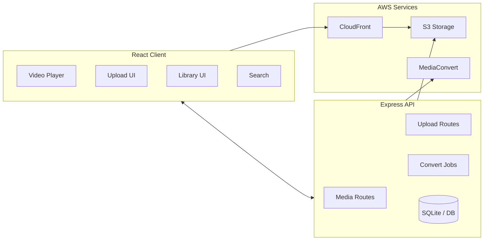
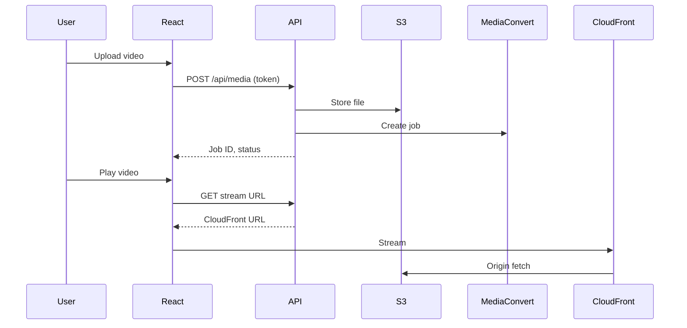

# PanaStream – Architecture

High-level architecture for PanaStream: React client, Express API, and AWS services.

## High-level architecture



## Component overview

| Component | Role |
|-----------|------|
| **React Client** | Video player, upload UI, library, search; talks to API and streams via CloudFront. |
| **Express API** | Media CRUD, upload handling, conversion job submission, SQLite/DB; uses PANASTREAM_API_TOKEN for auth. |
| **S3** | Raw uploads and processed media storage. |
| **CloudFront** | CDN for streaming; origin S3. |
| **MediaConvert** | Video transcoding (e.g. MOV → MP4). |

## Data flow (simplified)



## Project layout

```
panastream/
├── client/          # React app (upload, library, player)
├── server/          # Express API, routes, middleware, env.example
├── app.yaml         # DigitalOcean App Platform spec (root)
├── .do/             # Additional DO app specs
├── server/env.example   # Env template (copy to server/.env)
├── generate-token.js    # Generate PANASTREAM_API_TOKEN
├── README.md, README-SECURITY.md
├── DEPLOY-DO.md, DEPLOYMENT.md, ...
└── docs/ARCHITECTURE.md # This file
```

## Security (relevant for public repo)

- **API token**: Set `PANASTREAM_API_TOKEN` in `server/.env`; generate with `node generate-token.js`. Use `Authorization: Bearer <token>` or `X-API-Key: <token>`.
- **AWS**: Use env vars (AWS_ACCESS_KEY_ID, AWS_SECRET_ACCESS_KEY, etc.); never commit `.env`.
- **Secrets**: All sensitive values in app specs are placeholders or set in dashboard; see [README-SECURITY](README-SECURITY.md).

## Clone and run

```bash
git clone https://github.com/xuxogarcia/panastream.git
cd panastream
npm run install-all
cd server && cp env.example .env && cd ..   # Edit .env with your config
npm run dev
```

See [README](README.md) for full setup and AWS configuration.
